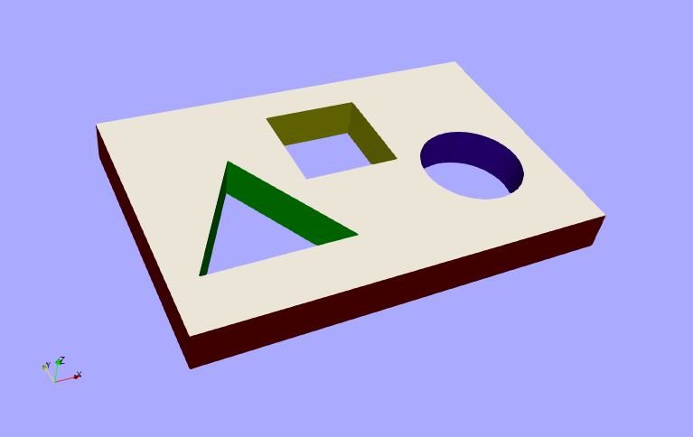
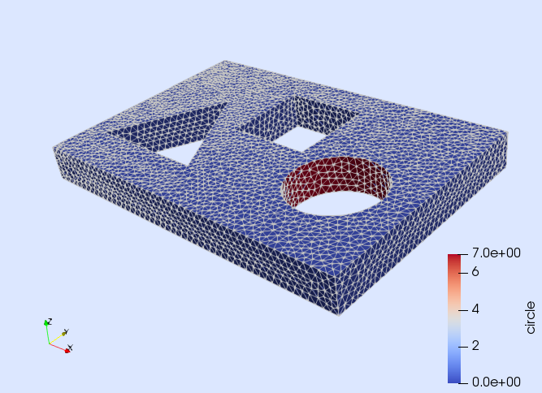
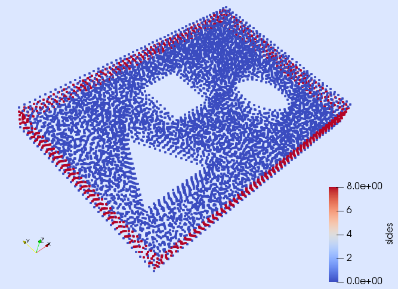
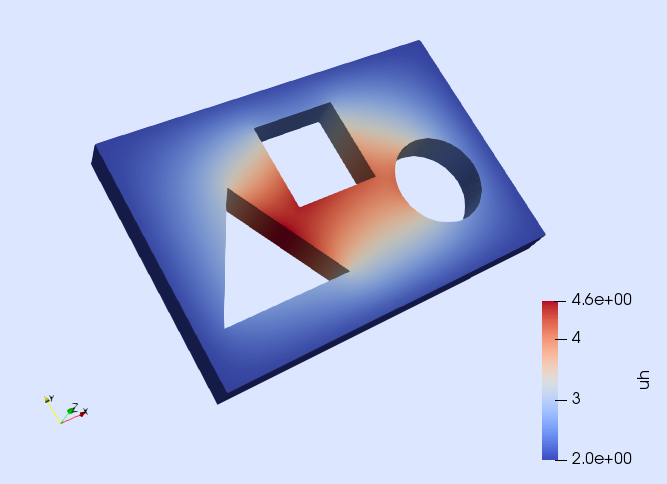

# Tutorial 1: Poisson equation

## Problem statement

We want to solve the Possion equation on the 3D domain depicted in the figure below with Dirichlet and Neumann boundary conditions. Dirichlet boundary conditions are applyed on $\Gamma_{\rm D}$, being the outer sides of the prism (marked in red). Non-homogeneous Neumann conditions are applyed to the internal boundaries $\Gamma_{\rm G}$, $\Gamma_{\rm Y}$, and $\Gamma_{\rm B}$ (marked in green, yelow and blue respectively). And homogeneous Neumann boundary conditions are applyed in $\Gamma_{\rm W}$, the remaining portion of the boundary (marked in white).



Formally, the problem to solve is: find $u$ such that

\begin{equation}
\left\lbrace
\begin{aligned}
-\Delta u = f  \ \text{in} \ \Omega\\
u = g \ \text{on}\ \Gamma_{\rm D}\\
\nabla u\cdot n = h \ \text{on}\  \Gamma_{\rm N}\\
\end{aligned}
\right.
\end{equation}

being $n$ the outwards unit normal vector to the Neumann boundary $\Gamma_{\rm N} \doteq \Gamma_{\rm G}\cup\Gamma_{\rm Y}\cup\Gamma_{\rm B}\cup\Gamma_{\rm W}$. For simplicity, we chose $f(x) = 1$, $g(x) = 2$, and $h(x)=3$ on $\Gamma_{\rm G}\cup\Gamma_{\rm Y}\cup\Gamma_{\rm B}$ and $h(x)=0$ on $\Gamma_{\rm W}$. The variable $x$ is the position vector $x=(x_1,x_2,x_3)$.

## Numerical scheme

In this first tutorial, we use a conventional Galerkin finite element (FE) method with conforming Lagrangian finite element spaces. In that case, the model problem reduces to the weak equation: find $u\in U_g$ such that $ a(v,u) = b(v) $ for all $v\in V_0$, where $U_g$ and $V_0$ are the subset of functions in $H^1(\Omega)$ that fulfill the Dirichlet boundary condition $g$ and $0$ respectively. The bilinear and linear forms for this problems are
$$
a(v,u) \doteq \int_{\Omega} \nabla v \cdot \nabla u \ {\rm d}\Omega, \quad b(v) \doteq \int_{\Omega} v\ f  \ {\rm  d}\Omega + \int_{\Gamma_{\rm N}} v\ g \ {\rm d}\Gamma_{\rm N}
$$

While solving this problem in Gridap, we are going to build the main objects that are involved in this equation in a very inuitive way.

## Implementation

The step number 0, is to load the Gridap project. If you have followed the steps of the `README.md` file, it is simply done like this:

```julia
using Gridap
```

As in any FE simulation, we need a discretization of the computational domain, which, in addition, is aware of the different boundaries to impose boundary conditions. This information is provided in Gridap by objects inheriting from the abstract type `DiscreteModel`. In the following line, we build an instance of `DiscreteModel` by loading a model from a `json` file.

```julia
model = DiscreteModelFromFile("../models/model.json");
```

You can easily inspect the generated model in Paraview by writting it to `vtk` format.

Previous line generates four different files `model_0.vtu`, `model_1.vtu`, `model_2.vtu`, and `model_3.vtu` containing the vertices, edges, faces, and cells present in the discrete model. Moreover, you can easily inspect, which boundaries are defined within the model.

For instance, if we want to see which faces of the model are on the boundary $\Gamma_{\rm B}$ (i.e., the walls of the circular hole), open the file `model_2.vtu` and chose coloring by the element field "circle". You should see that only the faces on the circular hole hava a value different from 0.



On the other hand, to see which vertices are on the Dirichlet boundary $\Gamma_{\rm D}$, open the file `model_0.vtu` and chose coloring by the field "sides".



You can easily see, by inspecting the files in paraview, that the walls of the triangular hole $\Gamma_{\rm G}$ and the walls of the square hole $\Gamma_{\rm Y}$ are identified in the model with the names "triangle" and "square" respectively.

```julia
order = 1
diritag = "sides"
fespace = ConformingFESpace(Float64,model,order,diritag);

g(x) = 2.0
V = TestFESpace(fespace)
U = TrialFESpace(fespace,g);

trian = Triangulation(model)
quad = CellQuadrature(trian,order=2);

neumanntags = ["circle", "triangle", "square"]
btrian = BoundaryTriangulation(model,neumanntags)
bquad = CellQuadrature(btrian,order=2);

f(x) = 1.0
a(v,u) = inner( ∇(v), ∇(u) )
b_Ω(v) = inner(v, f)
t_Ω = AffineFETerm(a,b_Ω,trian,quad);

h(x) = 3.0
b_Γ(v) = inner(v, h)
t_Γ = FESource(b_Γ,btrian,bquad);

assem = SparseMatrixAssembler(V,U);

op = LinearFEOperator(V,U,assem,t_Ω,t_Γ);

ls = LUSolver()
solver = LinearFESolver(ls);

uh = solve(solver,op);

writevtk(trian,"results",cellfields=["uh"=>uh]);
```



*This page was generated using [Literate.jl](https://github.com/fredrikekre/Literate.jl).*

